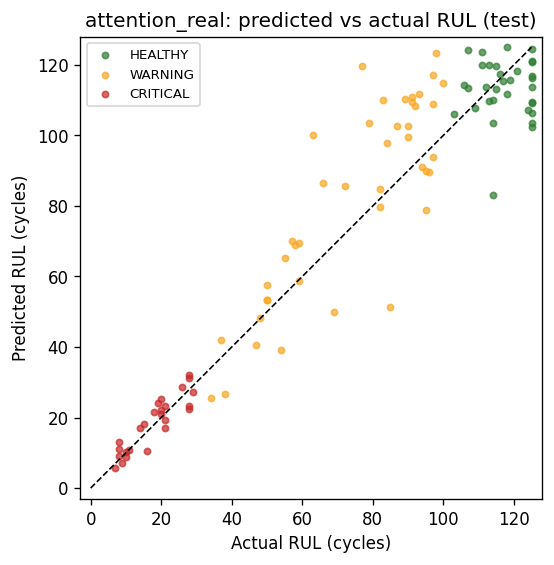
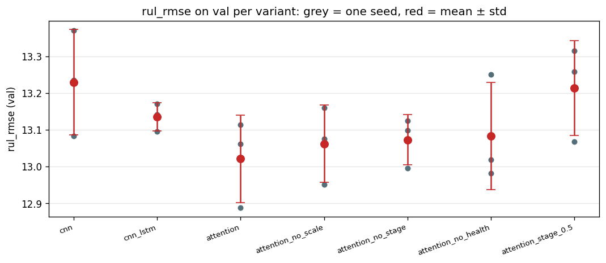
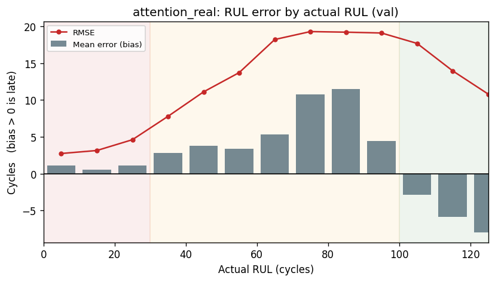
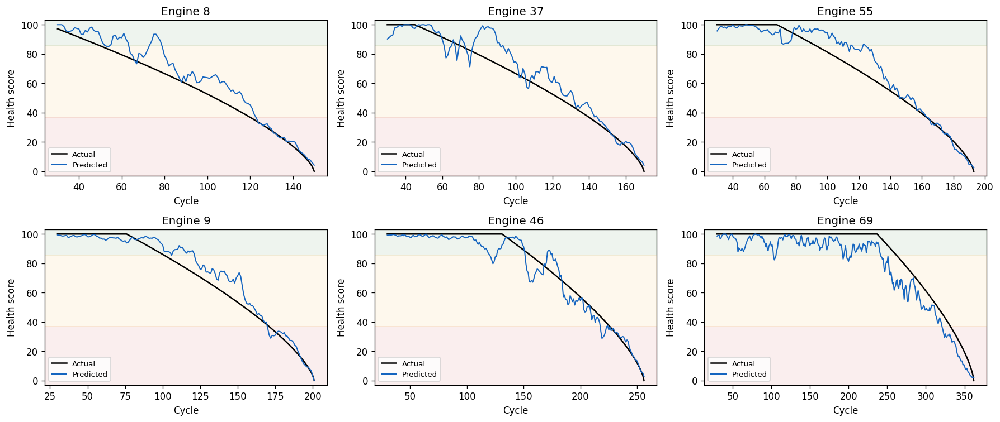
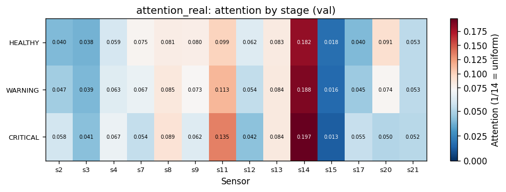
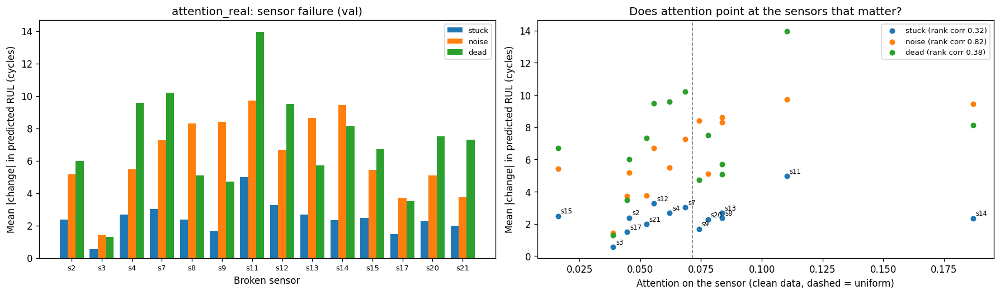
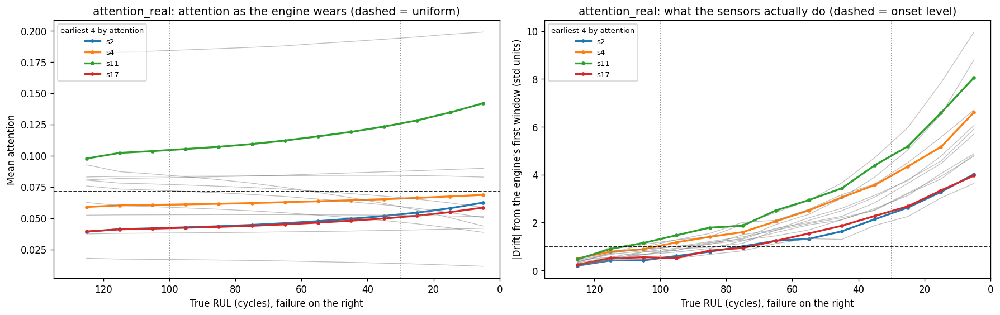

# Engine Health & Degradation Prediction: Report

Team Fast Code AI. NASA C-MAPSS FD001.

## Summary

We trained a multi-output model that reads the last 30 cycles of 14 engine sensors and predicts remaining useful life (RUL), a 0–100 health score, and a health stage (HEALTHY, WARNING, CRITICAL). A sensor attention layer shows which sensors the model relies on.

- **Accuracy.** All three model stages reach about 13 cycles RUL RMSE on the validation engines. The attention model is the best on average (13.02 ± 0.12 over 3 seeds), but the margin over CNN+LSTM (13.14 ± 0.04) is about one standard deviation. Attention does not clearly improve accuracy. Its value is the explanation.
- **Where the models fail.** Errors are small near failure (CRITICAL: RMSE 3.6) and largest in the middle of life (WARNING: RMSE 16.1). There the models predict too late, which the NASA score penalises most.
- **What the model watches.** Across all seeds, breaking s9, s13, s11, s14 or s8 moves the prediction most. Attention agrees with this ranking at a rank correlation of about 0.7. s11 (static pressure at the HPC outlet) is the most consistent early warning sensor: its reading drifts first and its attention rises toward failure.
- **Caveat.** The attention ranking changes between training seeds (rank correlation 0.55). The ranking from breaking sensors is much more stable (0.75 to 0.91). Read attention as a rough guide, not an exact measurement.

## Data

FD001 has 100 training engines, each recorded from a healthy start until failure, and 100 test engines whose records stop before failure. Their true remaining life is in `RUL_FD001.txt`. Every row is one engine in one cycle, with 3 operating settings and 21 sensors.

- 7 sensors never vary in FD001 (s1, s5, s6, s10, s16, s18, s19) and are dropped, which leaves 14.
- The training engines are split 80/20 **by engine**, not by window, so overlapping windows from one engine cannot appear in both train and validation.
- Min-max scaling is fitted on the 80 training engines only.
- Inputs are sliding windows of 30 cycles: 14,070 train windows and 3,661 validation windows. The test set is one window per test engine (its last 30 cycles), 100 in total.
- Labels come from RUL capped at 125:
  - Health score = 100 · (RUL / 125)^0.7.
  - Stage is HEALTHY if RUL > 100, CRITICAL if RUL < 30, otherwise WARNING.

## Models

| Stage | Model | What it adds |
|---|---|---|
| 1 | CNN | 1D convolutions over time, the 14 sensors as channels |
| 2 | CNN + LSTM | An LSTM reads the conv features in order |
| 3 | Attention + CNN + LSTM | At each timestep a small network scores the 14 sensors and a softmax turns the scores into weights that sum to 1. The input is multiplied by the weights times 14, so uniform attention leaves the input unchanged. |

All three models end in the same three heads: RUL, health and stage. The loss is MSE on RUL and on health (both scaled to 0–1) plus 0.1 × cross-entropy on stage, with inverse-frequency class weights. Training runs for 30 epochs with Adam at a learning rate of 1e-3, keeping the checkpoint with the best validation RUL RMSE.

## Results

### Single run (seed 42)

| Model | Val RMSE | Test RMSE | Test MAE | Test NASA | Test stage acc |
|---|---|---|---|---|---|
| CNN | 13.30 | 13.45 | 9.97 | 334 | 0.80 |
| CNN+LSTM | 13.34 | 12.70 | 9.35 | 303 | 0.82 |
| Attention | 12.99 | 12.88 | 9.46 | 302 | 0.81 |



### Ablations: mean ± std over 3 seeds, validation split (3,661 windows)

| Variant | RUL RMSE | RUL MAE | Health RMSE | Stage acc | Stage acc read off RUL |
|---|---|---|---|---|---|
| CNN | 13.23 ± 0.14 | 9.69 ± 0.27 | 8.45 ± 0.16 | 0.846 | 0.847 |
| CNN+LSTM | 13.14 ± 0.04 | 9.44 ± 0.24 | 8.33 ± 0.02 | 0.848 | 0.847 |
| **Attention** | **13.02 ± 0.12** | 9.55 ± 0.20 | 8.27 ± 0.09 | 0.848 | 0.848 |
| Attention, no ×14 scale | 13.06 ± 0.11 | 9.40 ± 0.29 | 8.26 ± 0.09 | 0.850 | 0.854 |
| Attention, no stage loss | 13.07 ± 0.07 | 9.56 ± 0.24 | 8.29 ± 0.05 | (untrained) | 0.851 |
| Attention, no health loss | 13.08 ± 0.15 | 9.59 ± 0.23 | (untrained) | 0.849 | 0.849 |
| Attention, stage weight 0.5 | 13.21 ± 0.13 | 9.78 ± 0.27 | 8.39 ± 0.09 | 0.844 | 0.845 |



What the ablations show:

- **Attention vs no attention:** 13.02 vs 13.14 RMSE. Attention is slightly better, but the seed spread overlaps. The test split (100 engines) ranks the variants differently, which is expected with so few rows. We do not claim an accuracy gain from attention.
- **The stage head adds nothing measurable.** Without the stage loss, RUL is just as accurate, and reading the stage off the predicted RUL is as accurate as the stage head (0.851 vs 0.848). A heavier stage weight (0.5) makes RUL slightly worse.
- **The health head is redundant.** Health is a fixed function of RUL, and dropping its loss leaves RUL unchanged. This was expected from the label definition.
- **The ×14 scale** matters little on validation, but without it the test results are worse and less stable (13.54 ± 0.48 vs 13.25 ± 0.10). We keep it.
- **WARNING is the hard stage.** Its recall is about 0.77 on validation and 0.63 on test, against more than 0.9 for the other stages.

### Errors along engine life (attention model, validation)

| True stage | Windows | RUL RMSE | Bias (pred − true) |
|---|---|---|---|
| HEALTHY | 1,641 | 12.1 | −7.2 (too early) |
| WARNING | 1,420 | 16.1 | +5.9 (too late) |
| CRITICAL | 600 | 3.6 | +0.9 |



The HEALTHY bias comes from the RUL cap. True RUL is flat at 125 early in life, while the model already sees slight wear. The WARNING bias is the one that matters operationally: between 60 and 100 cycles left, the model is about 8 cycles too optimistic on average, and about 11 between 70 and 90.



## Explainability

### Attention by stage



For the seed 42 model, s14 (corrected core speed) gets the most attention in every stage, about 2.6× uniform. s11 gains attention as the engine wears (0.099 → 0.113 → 0.135), and s15 (bypass ratio) is almost ignored.

Across 4 attention models (seeds 42, 0, 1, 2), the ratio of CRITICAL to HEALTHY attention is consistent in direction:

- **Gain attention toward failure:** s2 (1.24× on average), s11 (1.18×), s8, s17, s3, s4. s11 is at or above 1 in every seed.
- **Lose attention toward failure in every seed:** s20 (0.68×), s21 (0.74×), s12 (0.82×), s7 (0.83×).

### Sensor failure demo

Each sensor is broken in turn in every validation window, and we measure how far the predicted RUL moves. Three ways of breaking it:

- **stuck:** the sensor holds its first reading of the window.
- **noise:** noise with std 0.3 is added, on a 0–1 scale.
- **dead:** the sensor reads 0.



| | Noise | Dead | Stuck |
|---|---|---|---|
| Sensors that move RUL most (mean over 4 seeds) | s9, s13, s11, s14, s8 | s7, s12, s11, s20, s4 | s11, s12, s7, s13, s9 |
| Stability of that ranking across seeds | 0.91 | 0.75 | 0.85 |
| Attention vs effect, rank correlation (seed 42) | 0.82 | 0.38 | 0.32 |
| Attention vs effect, rank correlation (seeds 0, 1, 2) | 0.50, 0.83, 0.67 | 0.32, 0.42, 0.18 | 0.22, 0.53, 0.27 |
| Worst RUL RMSE once broken (clean: 13.0) | 19.8 | 23.4 | 14.4 |

- Under noise, attention tracks real importance well (rank correlation about 0.7 on average).
- Dead and stuck sensors are a different test. Their effect depends on how far 0, or a frozen value, lies from the sensor's normal range, which attention does not encode.
- **The model does not look away from a broken sensor.** For noisy and stuck sensors, the attention on the broken sensor is unchanged (within 1%). For a dead sensor the median is 0.98× normal (range 0.84× to 1.25× across sensors and seeds). Attention explains what the model relies on, but it does not detect sensor faults. A deployed system would need a separate sanity check on its inputs.

### Early warning

For each sensor we compare two things in 10-cycle bins of true RUL:

- **Attention:** the mean attention on the sensor.
- **Signal:** how far the raw reading has drifted from the engine's own first window, in units of that window's spread.

A sensor's onset is the highest RUL from which the value stays above its threshold all the way to failure.



- **Signal:** s11 and s9 drift first (onset at about 100 cycles left), followed by s4, s7 and s12 (about 90).
- **Attention:** s2, s11 and s17 rise earliest (from 60–70 cycles left). s11 is the only sensor that is both an early signal and gains attention steadily from the start of the window. It is the clearest early warning sensor.
- s7, s12 and s20 drift early but lose attention toward failure, so the model gets that information from other sensors.

The project context proposed s2 and s7 as early sensors and s11, s14 and s17 as late ones. The data partly disagrees:

- s7 does drift early, but the model's attention on it falls.
- s2 gains attention but drifts relatively late.
- s11 is early, not late.

## The output card

```
python -m evaluation.card --engine 42 --cycle 150
```

```
+--------------------------------------------------+
| Engine 42 - Cycle 150                            |
| Health Score   24 / 100                          |
| Stage          CRITICAL  [!!!]                   |
| Estimated RUL  16 cycles                         |
| Actual RUL     16 cycles                         |
| Watching       s14 (2.5x), s11 (1.8x), s8 (1.2x) |
+--------------------------------------------------+
```

The card works from raw sensor rows. It applies the training scaler, takes the last 30 cycles and runs the attention model. `--fleet` lists all 100 test engines with the most urgent first: 27 CRITICAL, 25 WARNING, 48 HEALTHY. The fleet predictions match the test predictions file exactly.

## Limitations

- **One dataset, one operating condition.** FD001 only. FD002 and FD004 have six operating conditions and would need per-condition scaling.
- **The test set has 100 windows.** Differences of a few tenths of RMSE on test are noise. Use the validation split, or more seeds, to compare models. Validation was also used to pick the best epoch, so validation numbers are slightly optimistic.
- **Attention is not stable across seeds,** and it is only a rough proxy for importance. Any claim about a single sensor should be checked with the sensor failure demo.
- **RUL is capped at 125.** The model cannot distinguish between engines with more than 125 cycles left, by design.
- **No hyperparameter tuning** beyond the ablations. All runs use 30 epochs and the same architecture sizes.

## Reproduce

See [README.md](README.md), section "Run the whole project". Everything runs on a laptop CPU. The ablation sweep (21 runs) takes about 25 minutes.
